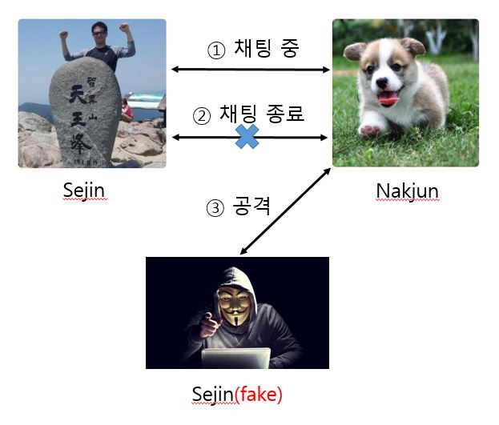

## HER Messenger - 정세진

### 취약점
- HER 메신저는 접속시 별도의 인증절차가 없음을 이용
- 헐 메신저에서 누구나 원하는 누군가인 척 할 수 있음

---
### 공격 모델


---
### 문제점
  - 기존 key protocol을 수정하지 않을 경우 공격 불가
    - Attacker가 Sejin(fake)의 아이디로 로그인은 가능하나,
    - 채팅내용을 암호화(enc) 할 때, Nakjun은 Sejin(fake)와 채팅할 때도    
      Sejin(real)의 아이디로 암호화(enc)
    - 결국 Sejin(fake)는 복호화(dec)할 수 없어 오류가 발생하고, 해당파일에 있는 code 수정 필요  

- key protocol 수정
  -  기존 메신저 아이디로 암/복호화 -> 아이디별 fingerprint로 암/복호화
  - onion-Team3 원격저장소의 key 브랜치의 수정된 key protocol 활용하였음

---
### 실행방법
- Attacker는 githubA로 접속하여 채팅 리스트에서 공격 대상자를 확인
  ```
  =====================
  nakjun : 172.17.0.3
  sejin : 172.17.0.2
  =====================
  ```
- 채팅 리스트에서 공격하고자 하는 대상의 아이디 sejin(fake)으로 키를 생성
  ```
  $gpg --gen-key
  ```
- 공격자용 Her Messenger 프로그램 만들기
  - Her Messenger 파일 전체 복사 후 attacker 폴더에 저장
  - sejin(fake)의 sejin.key, sejin.pub 파일을 attacker-testkey 폴더에 저장
  - attacker 폴더의 도커파일 실행
    ```
    $AutoDocker.sh
    ```
---
### 실행방법
- 공격자용 Her Messenger 프로그램 만들기
  - attacker 폴더의 AutoDocker.sh 파일 수정
    ```
    docker build -t onionmessenger .  
    -> docker build -t fonionmessenger .
    ```
  - attacker 폴더의 startMessenger.sh 파일 수정
    ```
    docker run -w /home/onionMessenger -it onionmessenger /bin/sh -c
    -> docker run -w /home/onionMessenger -it fonionmessenger /bin/sh -c
    ```
- attacker는 Sejin(real)이 채팅 리스트에서 나갈 때까지 기다림
- Sejin(fake)는 Nakjun(victim)에게 피싱공격

---
### DEMO


---
